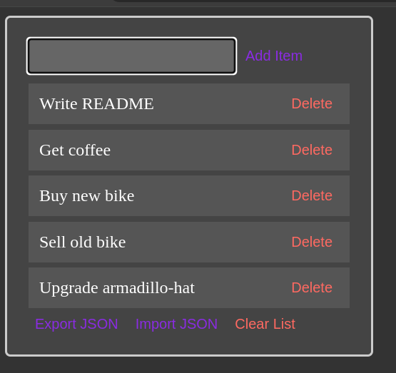

# Json Statusham
Json Statusham is a minimalistic task list to keep track of your tasks.
Add items to your list, drag-and-drop to change item-priority and export/import your list to/from JSON. All of this wrapped up in a soothing dark-theme with a bow on top to mitigate the feeling of staring into the sun. "Pair-programmed" with ChatGPT over the course of _almost_ an hour.

